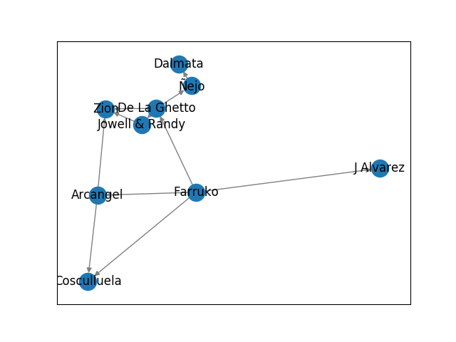

# Spotify Networks
[](https://mybinder.org/v2/gh/v715/Spotify-Net/master)

Spoti-Graph allows you to construct and analyze networks of related artists on Spotify!

## Overview
Spoti-Graph interfaces with the [Spotify Web API](https://developer.spotify.com/documentation/web-api/) to obtain all related artists.
You provide a starting artist, and the program executes a depth-first search to find neighbors.
Two artists are conneced by an edge if they have collaborated on a popular song or if Spotify lists them as related.

## Demo
To run install the package, execute the following:
```
git clone https://github.com/v715/Spoti-Graph
cd Spoti-Graph
pip install -r requirements.txt
```

At this point, you'll need to get authentifcation from the Spofity API. See [here]() for instructions on how to do that. Make a new file called `credentials.py` in the main directory and store your `Client ID` and `Client ID Secret` in it.

Run the demo using `python demo.py`. Here's the result!


